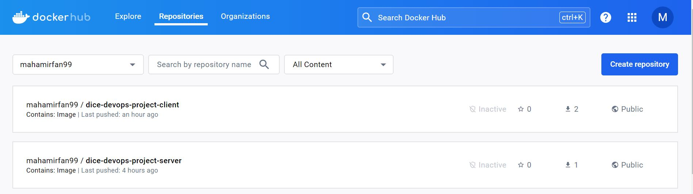
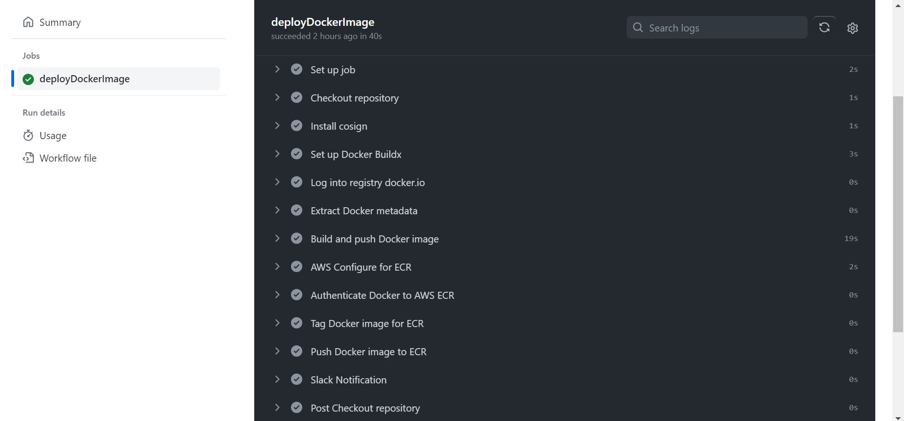
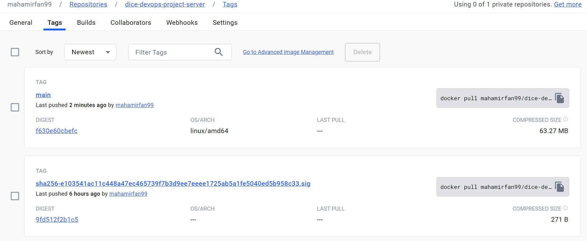
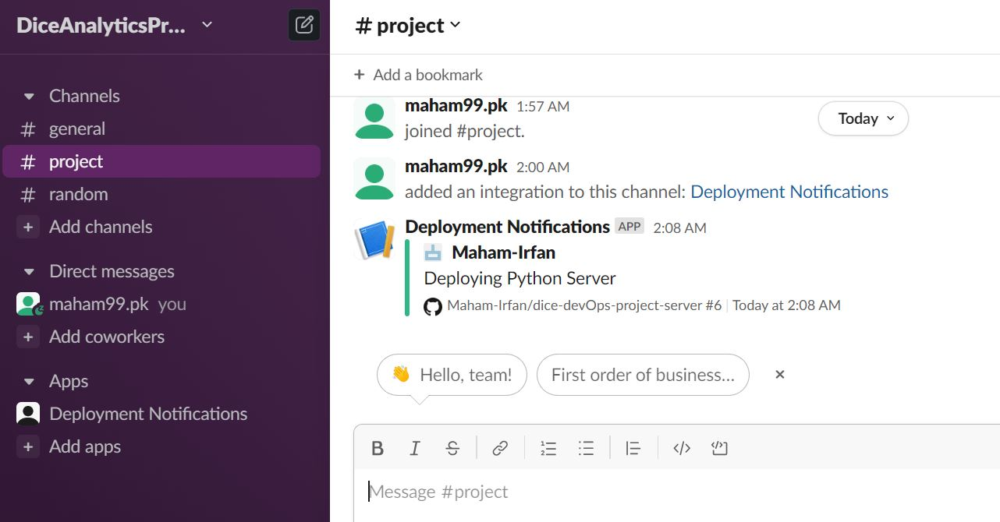
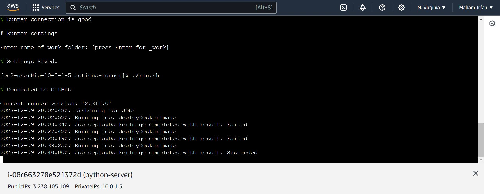
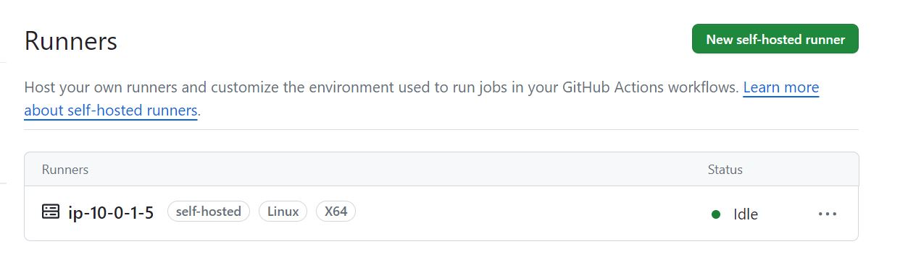

# DevOps - Project Server

## Step 1: Project Setup:
* Create a GitHub repository and clone this repository using the http link using the git clone command
* Inside the cloned foler, create a python file called "app.py"
* Install the dependencies needed for this project using the "pip install ${library}" command. These commands are then imported in the app.py file
* The app.py file contains the code to create a file of 1kB containing random data and its checksum which is stored in a folder called "serverdata". This folder is created if it does not exist to store the file. The Flask API is used to send this file along with the checksum to the client side when a request is received on the "/api" route. The route "/api" displays the checksum value of the file and the file contents that are sent as a response to the request received
* Run the app locally using "python app.py" to test the working of the API and as this app is exposed on port 8080 on all addresses(0.0.0.0), when the url is accessed from the browser it displays the response being sent
* Create a file called requirements.txt which contains all the libraries that must be installed for the working of this project
* Create a Dockerfile which pulls the python image, copies all the files in the folder in the container, installs all the dependencies in the requirements.txt file using the pip install command in the container, exposes the port that is used by the flask api and at the end runs the app.py file
* Create the docker-compose.yaml file which  does port binding and creates a volume and mounts the volume with the folder called "serverdata" which contains the file created
* Execute the command "docker compose up" which is used to build the image and to create and run a container using the built image. Check the functionality of the code inside the container by testing the app on the url given by the compose up command

* Create an AWS account
* Then using the search bar, open the IAM service and go to the User field
* Click on create new user and then set the name of the user
* Click next, attach policies to the user directly, The following policies should be attached to the user other wise the user will not be able to create an EC2 instance, push to the ECR repository and create a VPC

* Click on Create User
* When the user is created, go to Access Key and create an Access Key for the user to access the AWS CLI console. This will download the file containing the key id and secret in a csv file when the key is created

* Download the zip folder for Terraform and install it in a folder
* Download and Install the AWS CLI
* Open the command prompt in the terminal and type "aws configure"
* Give the access key id and secret key from the csv file that was downloaded when the access key was created
* It then asks for the region, set it to "us-east-1"
* It then asks for the Output, set it to "JSON"
* Now your AWS CLI is connected with the AWS console and any commands you type in the CLI, you will be able to check the result on the AWS console

* Go to the AWS console and search for the ECR service
* Click on new Repository and create a new private repository
* When the repository is created, click on the name of the repository to open its details and click on "View Push commands"
* Ensure that the docker image is present locally and the AWS CLI is configured
* Execute all the commands displayed when "View Push Commands" was clicked one by one in the command prompt. This pushes the docker image to the ECR repository which is then used by the EC2 instances

## Step 2: Creating the EC2 Instance and Configuring the VPC and Subnets
* Create folder in the root directory of the folder containing this project called "terraform"
* Create provider.tf file
* Create a aws_key_pair.tf while which creates a key which is used to ssh into the server. Without this key you won't be given access to execute the ssh command
* Create a main.tf file which creates the VPC, internet gateway which is connected to the VPC, creates a routing table which is connected to the internet gateway, assigns a subnet and created a security group to expose the ports of the host system so that the container can be deployed on the host port. It exposes port 8080 for http, 22 for ssh, 3020 for grafana, 9090 for prometheus and 9100 for node_exported
* An ec2 instance is created in the end of the main.tf file which is given the subnet created and the user-data contains the script which is run when the instance is launched. The script downloads and installs docker, docker compose, git, AWS cli in the instance and then configures the aws. Here I have mentioned "aws configure" command in the script for security reasons as the access key and secret can not be pushed but add the following commands in the script instead: 
aws configure set aws_access_key_id ${keyid}
aws configure set aws_secret_access_key ${keysecret}
aws configure set region us-east-1
The script won't proceed without these three commands, if the "aws configure" command is executed directly as it asks for the access key id and secret which can not be entered manually in this case
The configuration of AWS CLI was necessary because we have to pull the docker image from the ECR reposiotry and here we will again the same commands format as displayed by the "View Push Commands" when the ECR repository was clicked but we will replace the push commands with pull now
A temporary container is then run inside the instance from which the docker compose file is copied to the local directory in the instance 
The image name is then replaced with the pulled image in the docker-compose.yaml file
The docker compose file is then executed to run the python app within the container
*The output.tf file was created which contains the key created and the public IP address assigned to the instance
* Once all the tf files have been created, open the command prompt and change the directory to the one that contains the installed terraform.exe and then execute the following commands:
terraform -chdir="C:\Users\username\Project\server\terraform" init
terraform -chdir="C:\Users\username\Project\server\terraform" validate
terraform -chdir="C:\Users\username\Project\server\terraform" plan
terraform -chdir="C:\Users\username\Project\server\terraform" apply
The chdir contains the folder that contains the .tf files created for the project
* This launches the python-server instance which is assigned a public IP and can be accessed from the browser by going to the EC2/instances and by clicking on the server, the public IP becomes visible

## Step 4: GitHub Actions
* Open Docker Hub and create a new repository where the image has to be pushed by the workflow
* Go to the settings of the repository, then go to secrets and add the docker credentials as secrets to allow the image to be pushed from GitHub to docker repository
* In the repository, Go to Actions and configure the "Publish Docker Container" to create a workflow
* Pull the new code for workflow
* The registery name and image name were stored as environment variables in the workflow
* The job obtained from "Publish Docker Container" was modified to build and push the image to the repository created in dockher hub. The original verison pushes it to Github packages. The modification was made in the registery name, image name and the log in credentials for docker

* Go to the settings of the repository, then go to secrets and add the aws access key id, key secret and account id as secrets to allow the image to be pulled from the ECR, after which the tag is updated using the docker tag command "docker tag sourcetag targettag" and the image with the new tag is pushed to the ECR repository after which the python-server container is stopped and removed and then run again using the compose command with the new Image

* Go to Slack api for incoming messages and create a new slack app, add a chanel and then turn on the incoming webhooks, copy the webhook url and add that as a secret in the Github repository and add the commands to send a notification to the new slack channel when the deploy job is run

* Push the code to the GitHub repository and upon pushing the job is run which at the end sends a notification to the slack channel

* Go to aws and open the EC2 instance and click connect which opens the terminal to execute commands in the server
* Go to Actions in the GitHub repository and go to runners, add new self hosted runner for linux as I have used the ami for Amazon-Linux in my EC2 instance and execute the commands for "installation" displayed in the terminal opened in the aws for the instance
* Execute the command "sudo yum install libicu -y" in the terminal
* Execute the configuration commands displayed by the "Add New Runners" button
* Go to yaml file for workflow and replace all the runs-on: ubuntu commands with runs-on: self hosted
* Push the changes to the remote repository

